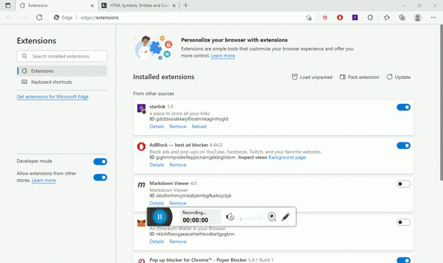

## Starlink

**A browser extension to easily store, manage and organize links**

### How it works

it stores all the links and folder stucture in json format in the
[chrome storage](https://developer.chrome.com/docs/extensions/reference/storage/) and then while displaying the links it uses the [Pagepeeker](https://pagepeeker.com/) api to generate screenshot of all the website
